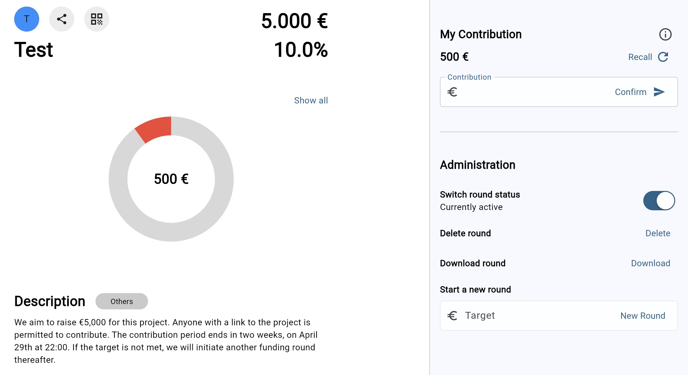

# Contrib

**Contrib** is a multi-platform application developed using Flutter. It allows users to set up their own [community supported project](https://csx-netzwerk.de/en/) and perform real-time funding with ease.

## Features
- Real-time anonymous contribution by users.
- Administration of project contribution rounds by owner.



## Prerequisites
Before you begin, ensure you have met the following requirements:
- **Flutter**: This project uses Flutter version `3.17.0` as frontend. You can download it from [Flutter official site](https://flutter.dev/docs/get-started/install).
- **Parse Server**: As backend this project uses Parse Server version `4.10.4`. Download it from their [repo on GitHub](https://github.com/parse-community/parse-server).


## Installation
To get started, follow these steps:
1. Clone the repository:
```bash
git clone https://github.com/pbrandl/contrib
```

2. Navigate to the project directory:
```bash
cd Contrib
```

3. Install dependencies:
```bash
flutter pub get
```

4. Run the app:
```bash
flutter run
```

## Issues and Contributing
In case you encounter any problems, please open a [issue](https://github.com/pbrandl/contrib/issues).

Also code commits are welcome! For major changes, please open an issue first to discuss what you would like to change.
